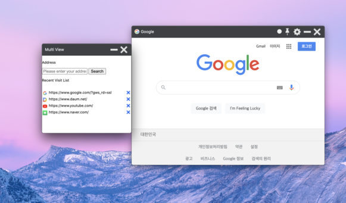
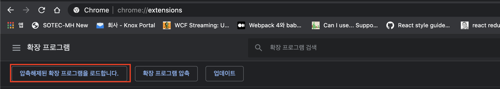

# MultiView
-----

크롬 확장프로그램이며 app 형식으로 되어있는 프로그램이라 앱스토어에 등록은 안된니다
(20년도 3월부터 안되네요)
참고:https://blog.chromium.org/2020/01/moving-forward-from-chrome-apps.html

크롬 브라우저에서 상단고정이 지원 안되니 동영상 보기에 유용할 겁니다!!
(https://github.com/[username]/[reponame]/blob/[branch]/image.jpg?raw=true)

Installlion
---

1.
chrome://extensions/ 접속 후 '압축해제된 확장프로그램을 로드합니다.'를 눌러 다운 받은 깃헙파일을 로드해줍니다.

2.
chrome://apps/ 에 들어가서 설치된 MultiView를 이용하면 된다!!(앱 아이콘 오른쪽 버튼을 누르고 '바로가기 만들기'를 이용하면 굳이 chrome://apps/에 들어오지 않고도 이용할 수 있다.)

